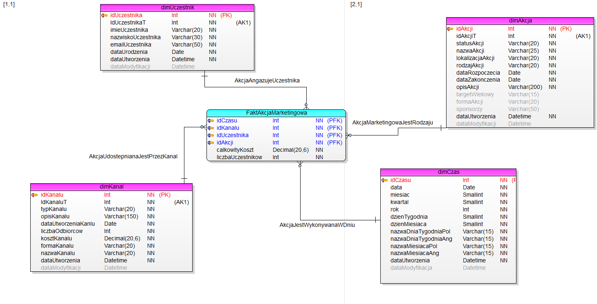
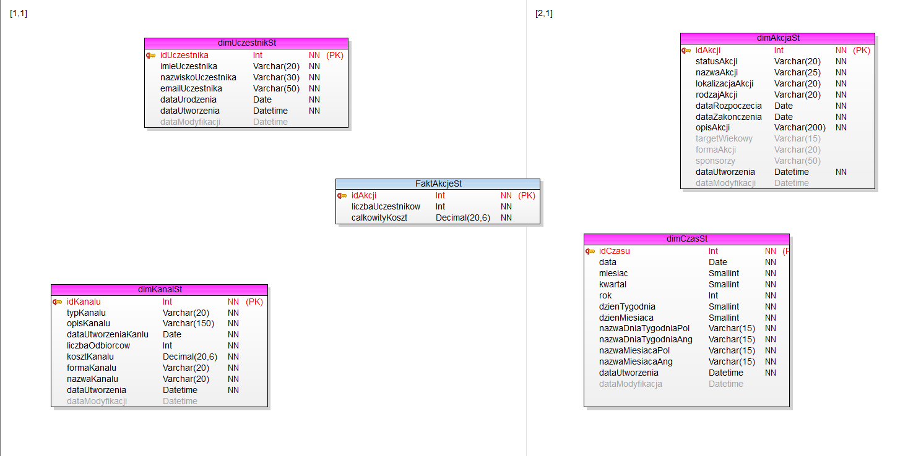

# Park Rozrywki

## Cel Projektu:
Celem projektu jest stworzenie kompletnego systemu analizy danych, obejmującego bazy danych, hurtownię danych (ETL), model OLAP oraz interaktywne dashboardy w środowisku Power BI Desktop.
Stworzona baza danych obejmuje obszar obsługi i kierowania firmą z sektora rozrywki, konkretnie – parkiem rozrywki. Dodatkowo istnieje druga baza danych skupiająca się na działaniach marketingowych realizowanych przez ten park.
Hurtownia ma zapewnić co najmniej możliwość gromadzenia i analizowania danych dotyczących sprzedaży i obłożenia atrakcji, jak też kosztów pracowniczych i przeprowadzanych akcji marketingowych,w tym ich kosztów.
## Narzędzia:

- **SQL Server Management Studio 19**
- **Toad Data Modeler 7.2**
- **Visual Studio 2019 (MS SSIS)**

Projekt realizowany jest w zespołach pięcioosobowych i składa się z 4 etapów.

## Organizacja Pracy:

### Ukończone: 
#### ETAP I (26.02.2024 - 11.03.2024)
**Cel:** Opracowanie dwóch relacyjnych baz danych w środowisku MS SQL Server.

BAZA I

BAZA II

#### ETAP II (11.03.2024 - 15.04.2024)
**Cel:** Celem tego etapu projektu jest implementacja hurtowni danych przy użyciu technologii ETL (Microsoft SQL Server Integration Services - SSIS) oraz opartej na modelu konstelacji gwiazdy. Celem jest stworzenie dwóch tabel faktów oraz pięciu tabel wymiarów.

**Projekt gwiazdy**
  
Pierwsza faza polegała na zaprojektowaniu modelu gwiazdy dla każdej z dwóch wcześniej stworzonych baz relacyjnych.
  
**ODS**
  
Następnie wcześniej stworzony model danych został poddany kolejnej modyfikacji, celem utworzenia warstwy pośredniej między systemem OLTP a hurtownią danych. Po zdefiniowaniu struktury ODS, skonfigurowano procesy w środowisku Visual Studio, umożliwiające pobieranie danych z baz źródłowych do ODS. Opracowano również mechanizm inkrementalny, który pozwala na przesyłanie do ODS tylko tych rekordów z baz źródłowych, które uległy zmianie.

BAZA I
1. Modelowanie i implementacja schematu struktur hurtowni danych - stoworzenie modelu konstelacji gwiazdy
   
2. Modelowanie schematu struktur ODS
   

BAZA II
1. Konstelacja gwiazdy dla bazy drugiej
   
2. ODS dla bazy drugiej 
   

#### ETAP III (15.04.2024 - 13.05.2024)
- **Cel:** Projekt i implementacja modelu OLAP w formie bazy tabelarycznej (MS SSAS) wraz z
zasilaniem

#### ETAP IV (13.05.2024 - 03.06.2024)
- **Cel:** Dashboardy w narzędziu analizy Microsoft Power BI Desktop.

## Planowana Data Ukończenia Projektu: 03.06.2024

## ENGLISH VERSION

# Amusement Park

## Project Objective:
The goal of the project is to create a complete data analysis system, including databases, data warehouse (ETL), OLAP model and interactive dashboards in Power BI Desktop environment.
The database created covers the area of operation and management of a company in the entertainment sector, specifically, an amusement park. In addition, there is a second database focusing on marketing activities carried out by the park.
At a minimum, the warehouse is to provide the ability to collect and analyze data on sales and occupancy of attractions, as well as employee costs and marketing activities carried out,including their costs.
## Tools:

- **SQL Server Management Studio 19**.
- **Toad Data Modeler 7.2**.
- **Visual Studio 2019 (MS SSIS)**.

The project is carried out in teams of five people and consists of 4 stages.

## Work Organization:

### Completed: 
#### STAGE I (26.02.2024 - 11.03.2024)
** Objective:** Develop two relational databases in MS SQL Server environment.

BASE I

BASE II

#### PHASE II (11.03.2024 - 15.04.2024)
** Purpose:** The purpose of this phase of the project is to implement a data warehouse using ETL technology (Microsoft SQL Server Integration Services - SSIS) and based on the star constellation model. The goal is to create two fact tables and five dimension tables.

**Star design**.
 
The first phase involved designing a star model for each of the two relational databases created earlier.
 
**ODS**.
 
The previously created data model was then further modified to create an intermediate layer between the OLTP system and the data warehouse. Once the ODS structure was defined, processes were configured in the Visual Studio environment to retrieve data from the source databases into the ODS. An incremental mechanism was also developed that allows only those records from the source databases that have changed to be sent to the ODS.

BASE I
1 Modeling and implementation of the schema of data warehouse structures - the constellation model of the star was created.
 
2 Modeling the schema of ODS structures
 

BASE II
1. star constellation for base two
 
2. the ODS for base two 

#### PHASE III (15.04.2024 - 13.05.2024)
- **Objective:** Design and implementation of an OLAP model in the form of a tabular database (MS SSAS) along with the
feeding

#### PHASE IV (13.05.2024 - 03.06.2024)
- **Objective:** Dashboards in Microsoft Power BI Desktop analysis tool.

## Planned Project Completion Date: 03.06.2024.
